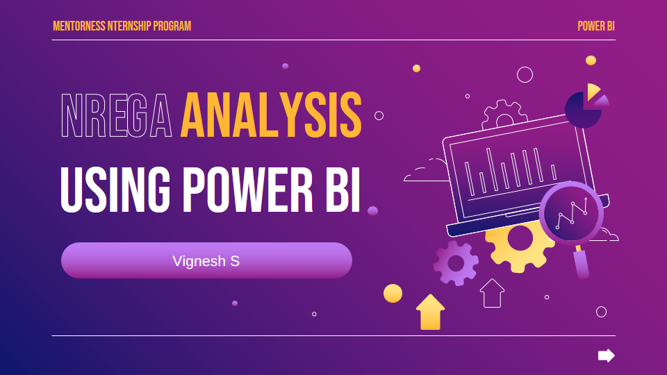
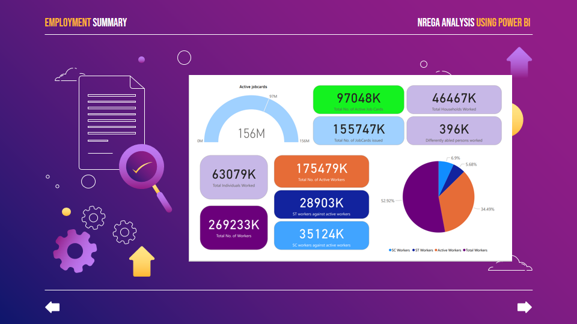
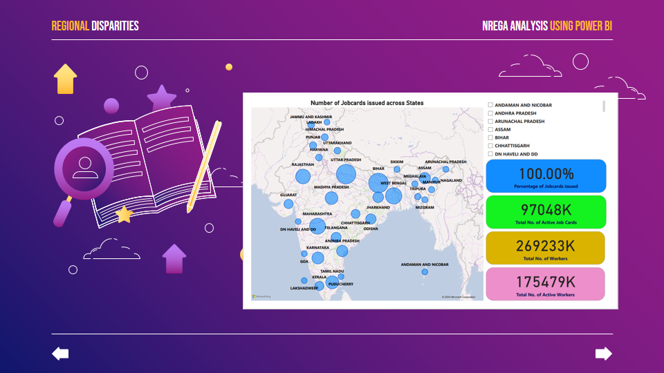
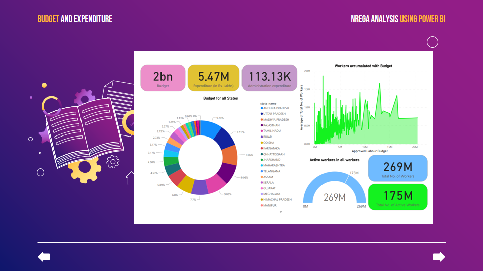
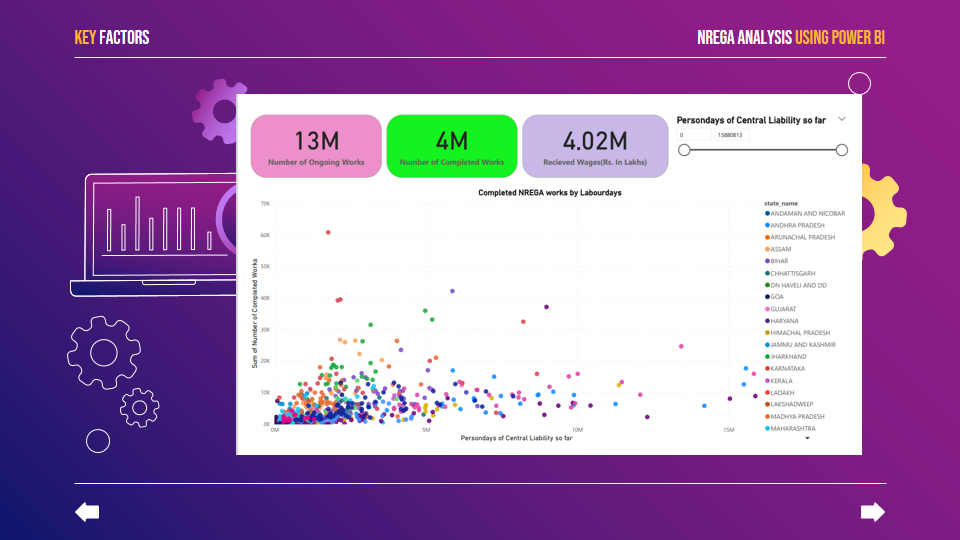
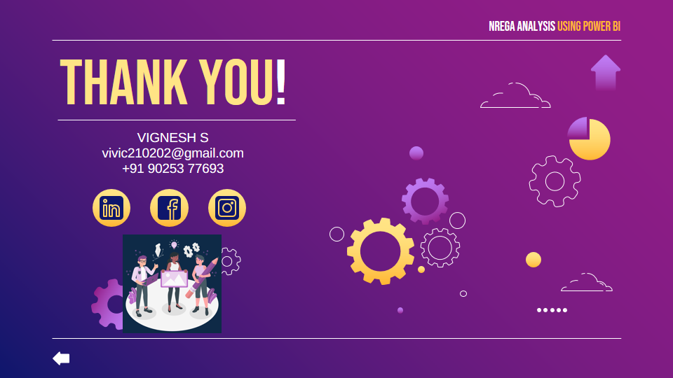

---

# 📊 NREGA Analysis using Power BI

## 📑 Table of Contents

1. [NREGA Scheme](#nrega-scheme)
2. [Objectives](#objectives)
3. [Power BI Reports](#power-bi-reports)
4. [Data-Driven Insights](#data-driven-insights)

## 📝 NREGA Scheme

The Mahatma Gandhi National Rural Employment Guarantee Act (MGNREGA), commonly known as NREGA, is a landmark initiative in India’s social security framework aiming to provide rural employment and sustainable development.

## 🎯 Objectives

### Problem Statements:

- How effective is NREGA in providing employment opportunities to rural households?
- Are there regional disparities in the implementation and outcomes of the scheme?
- What is the utilization of the allocated budget, and how does it correlate with employment generation?
- What are the key factors contributing to the completion of NREGA works, and are there any roadblocks to its success?
- Can data-driven insights guide policymakers and administrators in optimizing the scheme's impact?

## 📊 Power BI Reports

### Exploring NREGA with Power BI

1. **Employment Summary**:
    

2. **Regional Disparities**:
    

3. **Budget and Expenditure**:
    

4. **Key Factors**:
    

## 🔍 Data-Driven Insights

- NREGA provides a remarkable number of employment opportunities for rural households.
- There are regional disparities; the number of employees and beneficiaries varies across different states.
- Budget allocation directly impacts the number of active works; states with higher budgets have more active projects.
- Key factors influencing the success of the NREGA scheme include person-days and 100 days of employment, which inversely affect the number of works done.

## 📞 Contact
 

---

Feel free to contribute, open issues, and submit pull requests! 🎉

